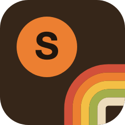
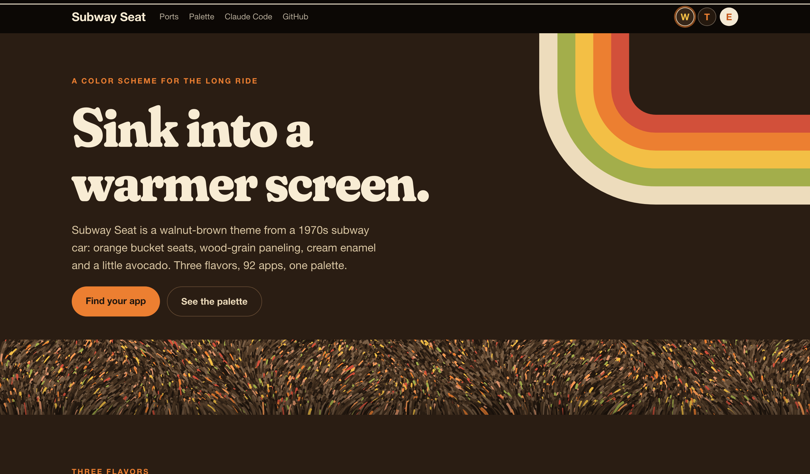
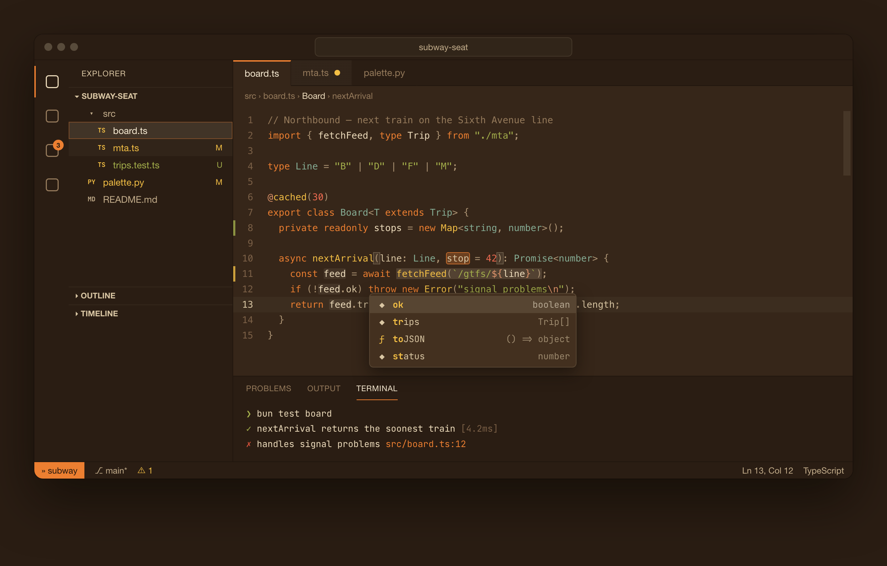
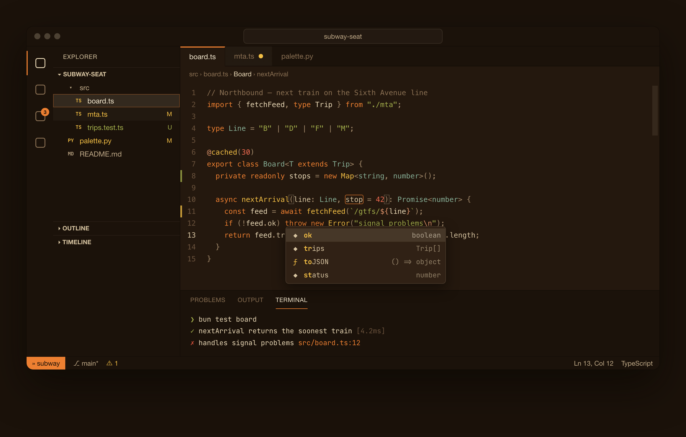
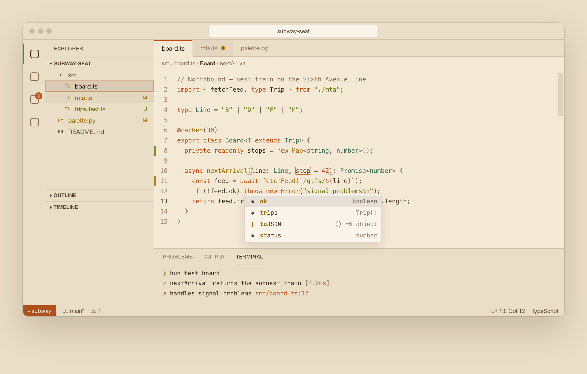
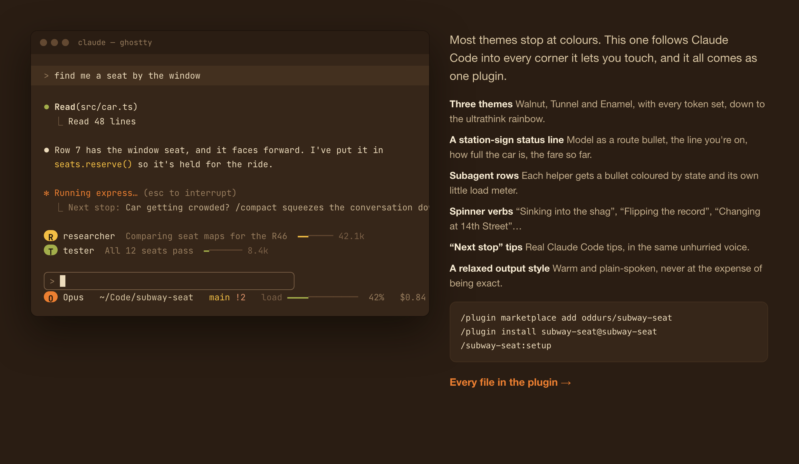

<p align="center">
  
</p>

<h1 align="center">Subway Seat</h1>

<p align="center">
  A walnut-brown color scheme from a 1970s subway car.<br />
  Parchment text, harvest gold, burnt orange, avocado. Sit back.
</p>

<p align="center">
  <a href="https://oddurs.github.io/subway-seat">Website</a> ·
  <a href="https://oddurs.github.io/subway-seat/palette">Palette</a> ·
  <a href="#ports">Ports</a> ·
  <a href="CONTRIBUTING.md">Add a port</a>
</p>

<p align="center">
  
</p>

## Three flavors

| | | |
|---|---|---|
| **Subway Seat** | Walnut | Wood paneling and orange bucket seats. The original. |
| **Subway Seat Tunnel** | Deep dark | The late local after midnight: espresso-deep, same warm lights. |
| **Subway Seat Enamel** | Light | Cream enamel panels in the morning sun. |

<p align="center">
  
</p>

<p align="center">
  
  
</p>

The whole spectrum isn't invited. Blue is faded denim and only marks links; magenta got reassigned to burnt orange; cyan is seafoam tile. Everything stays in the same warm room.

| Accent | Leads |
|---|---|
| Burnt orange | keywords, tags, the brand accent |
| Harvest gold | functions, commands, the cursor |
| Avocado | strings, additions |
| Seafoam tile | types, classes |
| Redbird | numbers, constants, deletions |
| Terracotta | escapes, regex, decorators |
| Faded denim | links and info |

## Ports

Every port is generated from [`palette.py`](palette.py) in all three flavors. Each folder in [`dist/`](dist) has the files; the [website](https://oddurs.github.io/subway-seat) has install steps and the full file for every one.

<!-- ports:start -->
| | |
|---|---|
| **Terminals** (19) | [Alacritty](dist/alacritty), [foot](dist/foot), [Ghostty](dist/ghostty), [GNOME Terminal](dist/gnome-terminal), [Hyper](dist/hyper), [iTerm2](dist/iterm2), [kitty](dist/kitty), [Konsole](dist/konsole), [Rio](dist/rio), [Tabby](dist/tabby), [Terminal.app](dist/terminal-app), [Terminator](dist/terminator), [Termux](dist/termux), [Tilix](dist/tilix), [Warp](dist/warp), [WezTerm](dist/wezterm), [Windows Terminal](dist/windows-terminal), [Xfce Terminal](dist/xfce-terminal), [Xresources](dist/xresources) |
| **Editors** (14) | [Emacs](dist/emacs), [GtkSourceView](dist/gtksourceview), [Helix](dist/helix), [JetBrains IDEs](dist/jetbrains), [Kakoune](dist/kakoune), [Lite XL](dist/lite-xl), [micro](dist/micro), [Neovim](dist/nvim), [Notepad++](dist/notepad-plus-plus), [Sublime Text](dist/sublime-text), [Vim](dist/vim), [VS Code](dist/vscode), [Xcode](dist/xcode), [Zed](dist/zed) |
| **Agents** (7) | [Aider](dist/aider), [Claude Code](dist/claude-code), [Codex CLI](dist/codex), [Copilot CLI, Amp & Goose](dist/terminal-agents), [Gemini CLI](dist/gemini-cli), [herdr](dist/herdr), [opencode](dist/opencode) |
| **Shell & prompt** (4) | [fish](dist/fish), [Nushell](dist/nushell), [Starship](dist/starship), [zsh-syntax-highlighting](dist/zsh-syntax-highlighting) |
| **CLI & TUI** (19) | [AIChat](dist/aichat), [Atuin](dist/atuin), [bat](dist/bat), [bottom](dist/bottom), [btop](dist/btop), [cava](dist/cava), [delta](dist/delta), [eza](dist/eza), [fzf](dist/fzf), [gh-dash](dist/gh-dash), [gitui](dist/gitui), [Glow](dist/glow), [k9s](dist/k9s), [lazygit](dist/lazygit), [spotify_player](dist/spotify-player), [tmux](dist/tmux), [vivid](dist/vivid), [Yazi](dist/yazi), [Zellij](dist/zellij) |
| **Apps** (14) | [Alfred](dist/alfred), [Chrome](dist/chrome), [Dark Reader](dist/dark-reader), [Discord](dist/discord), [Firefox](dist/firefox), [Obsidian](dist/obsidian), [qutebrowser](dist/qutebrowser), [Raycast](dist/raycast), [Slack](dist/slack), [Spotify (Spicetify)](dist/spicetify), [Telegram](dist/telegram), [Thunderbird](dist/thunderbird), [Vimium](dist/vimium), [Vivaldi](dist/vivaldi) |
| **Palettes** (15) | [Adobe Swatch Exchange](dist/ase), [Base16 / Base24](dist/base16), [Chroma](dist/chroma), [CSS variables](dist/css), [GIMP, Inkscape, Krita](dist/gimp), [Gogh](dist/gogh), [Hex list](dist/txt), [highlight.js](dist/highlightjs), [Palette JSON](dist/json), [Prism](dist/prism), [Procreate](dist/procreate), [Pygments](dist/pygments), [Sass](dist/scss), [Shiki](dist/shiki), [Tailwind CSS](dist/tailwind) |
<!-- ports:end -->

### The deep ones

- **VS Code** (and Cursor, Windsurf, VSCodium): a layered workbench with ~500 keys, including the AI panels of each fork. One chrome ground, grooves instead of lines, popovers on paper, translucent hovers and selections.
- **Claude Code**: themes for all three flavors, a station-sign status line, subagent rows, 70s spinner verbs, "Next stop" tips and a relaxed output style, bundled as a plugin:

  ```
  /plugin marketplace add oddurs/subway-seat
  /plugin install subway-seat@subway-seat
  /subway-seat:setup
  ```

  

- **Neovim**: a plugin with `setup({ flavor, transparent, italics, overrides })`, `colorscheme subway-seat` following `background`, lualine themes, and ~700 highlight groups for the popular plugins.
- **Zed**: a full theme family covering every style key, including the agent panel.

## Install everything at once

On macOS or Linux with fish:

```fish
git clone https://github.com/oddurs/subway-seat ~/Code/subway-seat
~/Code/subway-seat/install.fish            # Walnut; or: install.fish enamel / tunnel
```

It links theme files for the apps you have installed and prints the one line each app needs to switch over. It doesn't edit your configs.

## How it's built

```
palette.py      flavors and roles: the only place colours live
ports/*.py      one small module per app, written against roles
build.py        runs every port for every flavor → dist/, checks the files parse
site/           the website (Next.js + StyleX), coloured by the same palette
```

```sh
./build.py                 # everything
./build.py --only vscode   # one port
./build.py --list          # what's there
```

## License

MIT. Take it, tweak it, ship it.
